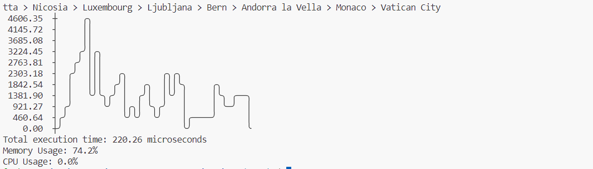
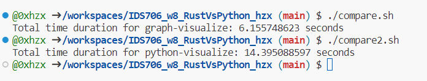

# Week 8 Transitioning from Python to Rust

- Take an existing Python script for data processing
- Rewrite it in Rust
- Highlight improvements in speed and resource usage

# Preparation
Prepare for the Python environment(Because the project is based on Rust image):

1. `sudo apt-get install -y python3 python3-pip`
2. `pip install -r requirements.txt`

Run Rust script:

`cargo run --manifest-path graph-visualize/Cargo.toml`

Run Python script:

`python3 -m python-visualize.main`

# Comparison between Rust and Python
I use Python and Rust separately to do graph visualization.

## For single run
For the purpose of recording the CPU, Memory usage and speed. We can derive these statistics with many package dependencies. Because the program is so light that we even can not get explicit difference between Rust and Python efficiency. Therefore, we need to do more repeat tests.

[Rust]


[Python]


## For 1000 times execution
We can use two shell scripts to calculate the result of 1000 times' run time. It is obvious that Rust is more effective than Python.



Possible explanations:
- Rust programs are typically compiled into native machine code, which means they don't need to be interpreted at runtime but can be executed directly on the computer's hardware. This compilation method often produces high-performance binary files as they benefit from optimizations at the hardware level, and they are generally much faster than interpreted languages.

- Python scripts, on the other hand, are interpreted. They are executed line by line by the Python interpreter. This means that Python code incurs some performance overhead at runtime. Although Python interpreters also perform some optimizations, their performance is usually lower compared to Rust's compilation optimizations.
# Technical Notes

## Makefile

Each subdirectory project uses this style to make it easy to test and run

```
format:
	cargo fmt --quiet

lint:
	cargo clippy --quiet

test:
	cargo test --quiet

run:
	cargo run 

all: format lint test run
```


# References

* [Rust Collections](https://doc.rust-lang.org/std/collections/index.html)
* [GitHub Copilot CLI](https://www.npmjs.com/package/@githubnext/github-copilot-cli)
* [Rust Fundamentals](https://github.com/alfredodeza/rust-fundamentals)
* [Rust Tutorial](https://nogibjj.github.io/rust-tutorial/)
* [Rust MLOps Template](https://github.com/nogibjj/mlops-template)
